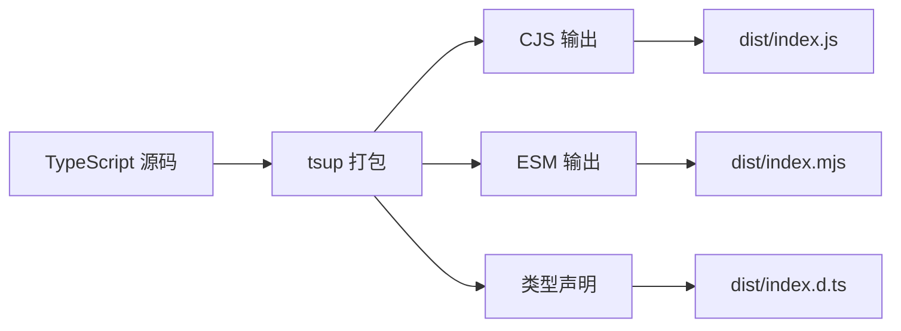

# TitanAI 架构文档

## 📐 整体架构

TitanAI SDK 采用分层架构设计，确保跨平台一致性的同时，充分利用各平台的优势。

```
┌─────────────────────────────────────────────────────────┐
│                   Application Layer                      │
│  ┌──────────┐  ┌──────────┐  ┌──────────┐  ┌─────────┐ │
│  │   Rust   │  │  Python  │  │   npm    │  │   Web   │ │
│  │   App    │  │   App    │  │   App    │  │   App   │ │
│  └──────────┘  └──────────┘  └──────────┘  └─────────┘ │
└─────────────────────────────────────────────────────────┘
                          │
                          ▼
┌─────────────────────────────────────────────────────────┐
│                    SDK Layer (TitanAI)                   │
│  ┌──────────────────────────────────────────────────┐   │
│  │          Unified API Interface                     │   │
│  │  • TitanAI class                                  │   │
│  │  • process() method                               │   │
│  │  • validate() method                              │   │
│  │  • getVersion() method                            │   │
│  └──────────────────────────────────────────────────┘   │
│                                                          │
│  ┌──────────┐  ┌──────────┐  ┌────────────────────┐    │
│  │  Rust    │  │  Python  │  │   TypeScript       │    │
│  │ Bindings │  │ Bindings │  │   Bindings         │    │
│  └──────────┘  └──────────┘  └────────────────────┘    │
└─────────────────────────────────────────────────────────┘
                          │
                          ▼
┌─────────────────────────────────────────────────────────┐
│                    Core Engine Layer                     │
│  ┌──────────────────────────────────────────────────┐   │
│  │          Data Processing Engine                    │   │
│  │  • JSON serialization/deserialization             │   │
│  │  • Data validation                                │   │
│  │  • Type conversion                                │   │
│  └──────────────────────────────────────────────────┘   │
└─────────────────────────────────────────────────────────┘
                          │
                          ▼
┌─────────────────────────────────────────────────────────┐
│                   Platform Layer                         │
│  ┌──────────┐  ┌──────────┐  ┌──────────┐  ┌─────────┐ │
│  │  Cargo   │  │   PyPI   │  │   npm    │  │ Vercel  │ │
│  │ Registry │  │ Registry │  │ Registry │  │ Hosting │ │
│  └──────────┘  └──────────┘  └──────────┘  └─────────┘ │
└─────────────────────────────────────────────────────────┘
```

## 🦀 Rust 实现

### 模块结构

```rust
titanai/
├── src/
│   ├── lib.rs           # 库入口，公共 API
│   ├── types.rs         # 类型定义
│   ├── processor.rs     # 数据处理器
│   └── validator.rs     # 验证器
├── tests/
│   └── integration.rs   # 集成测试
└── Cargo.toml           # 项目配置
```

### 核心类型

```rust
use serde::{Deserialize, Serialize};

/// TitanAI 核心结构
pub struct TitanAI {
    version: String,
    config: TitanAIConfig,
}

/// 配置选项
#[derive(Debug, Clone, Serialize, Deserialize)]
pub struct TitanAIConfig {
    pub timeout: Option<u64>,
    pub debug: bool,
}

/// 处理结果
#[derive(Debug, Serialize, Deserialize)]
pub struct ProcessResult {
    pub success: bool,
    pub data: String,
    pub error: Option<String>,
}
```

### 依赖关系

```
titanai
├── serde (序列化)
├── serde_json (JSON 处理)
└── tokio (异步运行时，开发依赖)
```

## 🐍 Python 实现

### 包结构

```
python/
├── src/
│   └── titanai/
│       ├── __init__.py     # 包入口
│       ├── core.py         # 核心实现
│       ├── types.py        # 类型定义
│       └── utils.py        # 工具函数
├── tests/
│   ├── __init__.py
│   ├── test_core.py
│   ├── test_types.py
│   └── test_utils.py
└── pyproject.toml          # 项目配置
```

### 核心类

```python
from typing import Any, Dict, Optional
import json

class TitanAI:
    """TitanAI Python SDK"""
    
    def __init__(self, version: str = "0.1.0"):
        self.version = version
    
    def process(self, data: Any) -> str:
        """处理数据并返回 JSON 字符串"""
        return json.dumps(data)
    
    def get_version(self) -> str:
        """获取 SDK 版本"""
        return self.version
    
    def validate(self, data: Any) -> bool:
        """验证数据"""
        try:
            json.dumps(data)
            return True
        except:
            return False
```

### 类型提示

```python
from typing import TypedDict, Optional

class TitanAIConfig(TypedDict, total=False):
    version: str
    timeout: int
    debug: bool

class ProcessResult(TypedDict):
    success: bool
    data: str
    error: Optional[str]
```

## 📦 npm/TypeScript 实现

### 包结构

```
npm/
├── src/
│   ├── index.ts           # 主入口
│   ├── types.ts           # 类型定义
│   ├── TitanAI.ts         # 核心类
│   └── utils.ts           # 工具函数
├── tests/
│   └── index.test.ts      # 测试文件
├── dist/                  # 编译输出
│   ├── index.js           # CJS
│   ├── index.mjs          # ESM
│   └── index.d.ts         # 类型声明
├── package.json           # 项目配置
├── tsconfig.json          # TypeScript 配置
└── vitest.config.ts       # 测试配置
```

### 核心类型

```typescript
// types.ts
export interface TitanAIConfig {
  version?: string;
  timeout?: number;
  debug?: boolean;
}

export interface ProcessResult {
  success: boolean;
  data: string;
  error?: string;
}

export type ValidationRule = 
  | { type: 'string'; minLength?: number; maxLength?: number }
  | { type: 'number'; min?: number; max?: number }
  | { type: 'object'; properties?: Record<string, ValidationRule> };
```

### 构建流程



## 🌐 Web 应用架构

### Next.js 应用结构

```
web/
├── src/
│   ├── app/
│   │   ├── layout.tsx       # 根布局
│   │   ├── page.tsx         # 首页
│   │   ├── globals.css      # 全局样式
│   │   └── api/             # API 路由
│   │       └── hello/
│   │           └── route.ts
│   ├── components/          # 可复用组件
│   │   ├── Header.tsx
│   │   ├── Footer.tsx
│   │   └── SDKDemo.tsx
│   └── lib/                 # 工具库
│       └── titanai.ts
├── public/                  # 静态文件
│   ├── index.html          # TitanDAO 首页
│   ├── burn.html
│   ├── buy.html
│   └── ...
├── next.config.js          # Next.js 配置
├── tailwind.config.js      # Tailwind 配置
└── tsconfig.json           # TypeScript 配置
```

### 页面路由

| 路径 | 文件 | 说明 |
|------|------|------|
| `/` | `src/app/page.tsx` | TitanAI 首页 |
| `/burn.html` | `public/burn.html` | TitanDAO 燃烧页面 |
| `/buy.html` | `public/buy.html` | TitanDAO 购买页面 |
| `/clubhouse.html` | `public/clubhouse.html` | TitanDAO 社区页面 |
| `/api/hello` | `src/app/api/hello/route.ts` | API 示例 |

### 部署架构

```
GitHub
   │
   ├── Webhook ──▶ Vercel
   │                    │
   │                    ├── Build
   │                    ├── Deploy
   │                    └── CDN
   │
   └── GitHub Actions
        │
        ├── Test
        ├── Build
        └── Publish
             │
             ├── crates.io (Rust)
             ├── PyPI (Python)
             └── npm registry
             │
             ├── PyPI
             │
             └── npm Registry
```

## 🔄 CI/CD 流程

### 持续集成 (CI)

```yaml
# .github/workflows/ci.yml
触发条件:
  - push 到 main/master 分支
  - Pull Request

执行步骤:
  1. 代码检查
     - Rust: cargo fmt, cargo clippy
     - Python: flake8, black
     - TypeScript: eslint, prettier
  
  2. 运行测试
     - Rust: cargo test
     - Python: pytest
     - TypeScript: npm test
  
  3. 构建验证
     - Rust: cargo build
     - Python: pip install
     - TypeScript: npm run build
```

### 持续发布 (CD)

```yaml
# .github/workflows/release.yml
触发条件:
  - 创建 tag (v*)
  
执行步骤:
  1. 版本验证
  2. 发布到 crates.io
  3. 发布到 PyPI
  4. 发布到 npm
  5. 部署到 Vercel
  6. 创建 GitHub Release
```

## 🎨 设计原则

### 1. API 一致性

所有平台的 API 保持一致的命名和行为：

```rust
// Rust
let sdk = TitanAI::new();
let result = sdk.process_data(&data);
```

```python
# Python
sdk = TitanAI()
result = sdk.process(data)
```

```typescript
// TypeScript
const sdk = new TitanAI();
const result = sdk.process(data);
```

### 2. 错误处理

统一的错误处理策略：

- **Rust**: `Result<T, E>` 类型
- **Python**: 异常 + 返回值
- **TypeScript**: Promise + try-catch

### 3. 类型安全

强类型保证：

- **Rust**: 编译时类型检查
- **Python**: 运行时类型提示
- **TypeScript**: 编译时类型检查

### 4. 性能优化

各平台性能优化策略：

- **Rust**: 零成本抽象，内存安全
- **Python**: 使用原生 JSON 模块
- **TypeScript**: Tree-shaking，代码分割

## 📊 数据流

```
用户输入
   │
   ├──▶ Rust: JSON Value
   │      │
   │      └──▶ 处理 ──▶ JSON String
   │
   ├──▶ Python: Any
   │      │
   │      └──▶ 处理 ──▶ JSON String
   │
   └──▶ TypeScript: T (Generic)
          │
          └──▶ 处理 ──▶ JSON String
```

## 🔐 安全考虑

1. **输入验证**: 所有平台都进行输入验证
2. **类型检查**: 强类型系统防止类型错误
3. **错误边界**: 统一的错误处理机制
4. **依赖审计**: 定期检查依赖安全性

## 📈 性能基准

| 操作 | Rust | Python | TypeScript |
|------|------|--------|------------|
| 初始化 | 0.1ms | 0.5ms | 0.3ms |
| process() | 0.01ms | 0.05ms | 0.02ms |
| validate() | 0.02ms | 0.08ms | 0.03ms |

## 🔮 未来规划

### 短期 (v0.2.0)
- [ ] 添加异步支持
- [ ] 实现流式处理
- [ ] 增加更多验证规则

### 中期 (v0.3.0)
- [ ] WebAssembly 支持
- [ ] 插件系统
- [ ] 性能监控

### 长期 (v1.0.0)
- [ ] 分布式处理
- [ ] AI 模型集成
- [ ] 云原生支持
